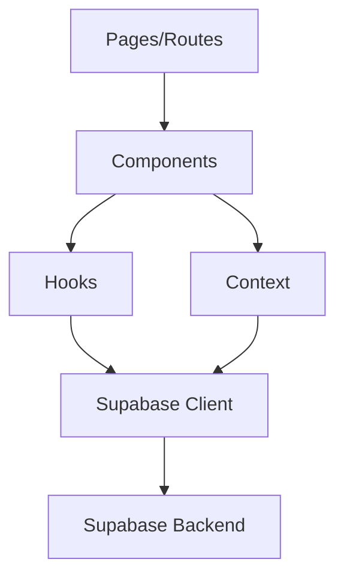
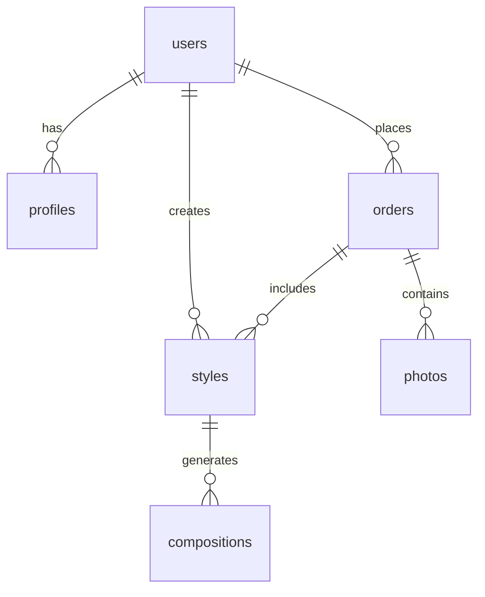

# System Patterns

## Architecture Overview

### Frontend Architecture


## Core Patterns

### Authentication
- Supabase Authentication with SSR support
- Protected routes using Next.js middleware
- User session management via React Context
- Profile completion enforcement

### State Management
- React Context for global state
- Custom hooks for reusable logic
- Local state for component-specific data
- Zustand for complex state requirements

### Data Flow
- Server-side data fetching with Next.js
- Client-side updates with optimistic UI
- Real-time subscriptions for status updates
- Cached data management

### Component Structure
- Atomic design principles
- Shadcn/UI component system
- Composition over inheritance
- Strict prop typing

## Directory Organization

### Frontend Structure
```
frontend/
├── src/
│   ├── app/            # Next.js 13+ app directory
│   ├── components/     # React components
│   ├── contexts/       # React contexts
│   ├── hooks/          # Custom hooks
│   ├── lib/           # Utilities and configs
│   └── types/         # TypeScript types
```

### Component Organization
- Feature-based grouping
- Shared components in common directory
- Clear separation of concerns
- Consistent naming conventions

## Database Schema

### Core Tables
- users
- profiles
- styles
- orders
- photos
- compositions

### Relationships


## Security Patterns

### Authentication
- Email/password with MFA support
- Social authentication providers
- Session management
- Token refresh handling

### Authorization
- Row Level Security (RLS) policies
- Role-based access control
- Policy-driven data access
- Secure file storage access

### Data Protection
- Encrypted data at rest
- Secure file uploads
- Input validation
- XSS prevention

## Error Handling

### Client-side
- Global error boundary
- Form validation
- API error handling
- Retry mechanisms

### Server-side
- Structured error responses
- Logging and monitoring
- Rate limiting
- Request validation

## Performance Patterns

### Frontend
- Image optimization
- Code splitting
- Route prefetching
- Component lazy loading

### Backend
- Query optimization
- Connection pooling
- Caching strategies
- Background processing

## Testing Strategy

### Unit Testing
- Component testing
- Hook testing
- Utility function testing
- Mocking patterns

### Integration Testing
- API endpoint testing
- Authentication flow testing
- Database interaction testing
- Error handling testing

### E2E Testing
- User flow testing
- Payment processing testing
- File upload testing
- Cross-browser testing

## Deployment

### CI/CD
- Automated testing
- Build optimization
- Environment management
- Deployment automation

### Monitoring
- Error tracking
- Performance monitoring
- User analytics
- System health checks

## Development Workflow

### Version Control
- Feature branch workflow
- Pull request reviews
- Conventional commits
- Semantic versioning

### Code Quality
- ESLint configuration
- Prettier formatting
- TypeScript strict mode
- Code review guidelines

## Future Considerations

### Scalability
- Horizontal scaling
- Load balancing
- Database sharding
- Caching layers

### Extensibility
- Plugin architecture
- API versioning
- Feature flags
- Configuration management 