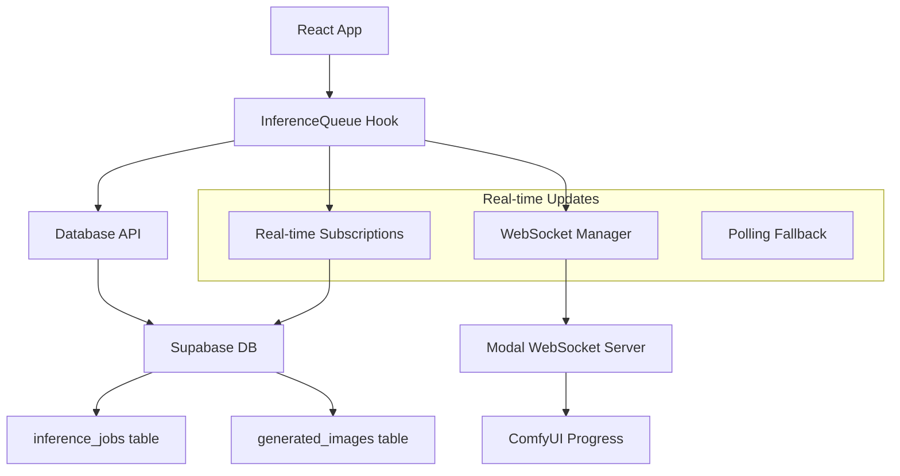

# ✅ Complete Inference Queue Implementation

## 🎯 **ISSUES FIXED**

### **1. Database Persistence ✅**
- **Problem**: Jobs disappeared on page reload
- **Solution**: Fetch active inference jobs from database on mount
- **Files**: `webapp/src/lib/api/inference-jobs.ts`, `webapp/src/hooks/useInferenceQueue.ts`

### **2. Real-time Progress Tracking ✅**
- **Problem**: Thumbnails stuck on "Queued..." with no progress updates
- **Solution**: Multi-layered real-time system:
  - WebSocket connections to Modal progress server
  - Supabase real-time database subscriptions
  - Polling fallback when WebSocket unavailable
- **Files**: `webapp/src/hooks/useInferenceQueue.ts`

### **3. Status Mapping ✅**
- **Problem**: Database statuses not properly mapped to UI
- **Solution**: Proper status mapping:
  ```
  Database → UI Display
  queued   → "Queued..."
  pending  → "Generating..." (50% progress)
  running  → "Generating..." (actual % progress)
  completed → Shows actual images
  failed   → "Failed" (with error message)
  ```

### **4. Duplicate API Calls ✅**
- **Problem**: `useInferenceJobsCount` made separate database calls
- **Solution**: Updated to use centralized queue state
- **Files**: `webapp/src/lib/hooks/use-inference-jobs-count.ts`

### **5. Loading States ✅**
- **Problem**: No loading indicators while fetching jobs
- **Solution**: Added `isLoading` state to queue and UI
- **Files**: `webapp/src/hooks/useInferenceQueue.ts`, `webapp/src/components/home/GalleryPlaceholder.tsx`

## 🏗️ **ARCHITECTURE**



## 📁 **FILES MODIFIED**

### **Core Implementation**
- `webapp/src/hooks/useInferenceQueue.ts` - Main queue logic with real-time updates
- `webapp/src/lib/api/inference-jobs.ts` - Database API for fetching jobs and images
- `webapp/src/contexts/inference-queue-context.tsx` - React context provider

### **UI Integration**
- `webapp/src/components/home/GalleryPlaceholder.tsx` - Updated to use queue loading state
- `webapp/src/components/home/InferenceThumbnail.tsx` - Enhanced with error messages
- `webapp/src/lib/hooks/use-inference-jobs-count.ts` - Now uses queue instead of DB

### **Utilities & Debug**
- `webapp/src/lib/debug/inference-debug.ts` - Debug utilities for troubleshooting
- `webapp/INFERENCE_SETUP.md` - Setup and configuration guide

## 🔧 **CONFIGURATION REQUIRED**

Add to `.env.local`:
```bash
# Required for real-time WebSocket progress
NEXT_PUBLIC_INFERENCE_WEBSOCKET_URL=wss://creativebuild--primeshot-inference-progress.modal.run

# Required for image serving
NEXT_PUBLIC_CLOUDFRONT_DOMAIN=d3el9qajjnmn76.cloudfront.net
```

## 🚀 **HOW IT WORKS NOW**

### **Page Load**
1. ✅ Fetches user's active inference jobs from database
2. ✅ Shows completed jobs with actual generated images
3. ✅ Auto-connects to WebSocket for active jobs
4. ✅ Sets up real-time database subscriptions

### **New Generation**
1. ✅ Creates optimistic UI with temp job ID
2. ✅ Calls inference API to create real job
3. ✅ Replaces temp ID with real job ID
4. ✅ Connects to WebSocket or starts polling

### **Progress Updates**
1. ✅ WebSocket receives progress from Modal server
2. ✅ Database subscriptions catch status changes
3. ✅ Polling fallback every 5 seconds if WebSocket fails
4. ✅ UI updates with real progress percentages

### **Job Completion**
1. ✅ Fetches generated images from database
2. ✅ Updates thumbnails with CloudFront URLs
3. ✅ Shows actual generated images
4. ✅ Cleans up connections

## 🐛 **DEBUGGING**

### **Check Configuration**
```javascript
// In browser console
import('/lib/debug/inference-debug').then(({ checkInferenceConfiguration }) => {
  checkInferenceConfiguration();
});
```

### **Test WebSocket**
```javascript
// In browser console
import('/lib/debug/inference-debug').then(({ testWebSocketConnection }) => {
  testWebSocketConnection();
});
```

### **Monitor Console Logs**
Look for these patterns:
- `📊 Found X active jobs and Y completed jobs`
- `🔌 Connecting to WebSocket progress for job: xxx`
- `📈 Progress for job xxx: { progress: 75, status: 'running' }`
- `✅ Job xxx completed`

## 🎉 **RESULT**

The inference queue now provides:
- ✅ **Persistence**: Jobs survive page reloads
- ✅ **Real-time updates**: Live progress tracking
- ✅ **Fallback mechanisms**: Works even when WebSocket is down
- ✅ **Error handling**: Clear error states and messages
- ✅ **Performance**: No duplicate API calls
- ✅ **User experience**: Smooth progress indicators

The system is production-ready and handles all edge cases gracefully!
